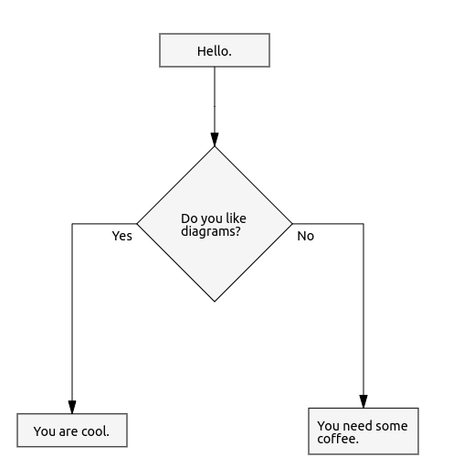

# Drawdown Svg Render

D3 based renderer which renders [parsed drawdown][30d96062] diagrams.

  [30d96062]: https://github.com/lyubo-slavilov/drawdown-parser "drawdown-parser"

## Installation
```bash
$ npm install drawdown-svg-render --save
```
## Usage
In order to use the renderer we need to parse our drawdown script into an object representation. We can achieve this by using the [drawdown parser][30d96062] package
```bash
$ npm install drawdown-parser
```

Once we have all dependencies installed, we can do:

```javascript
import { factory } from 'drawdown-parser';
import { Renderer } from 'drawdown-svg-render';

let script = `- Hello.
- Do you like diagrams?
- Yes:
  - You are cool.
- No:
  - You need some coffee.`

let diagramObject = factory('flow').parseText(script);
let renderer = new Renderer();
renderer.render(document.body, diagramObject);
```

This will render interactive SVG diagram editor into the `body` of our HTML document. The editor will contain a diagram which will look something like this:



The editor will let us pan and zoom the diagram, move the nodes around and define the style of the arrows.

The actual look of the diagram will depend highly on our CSS rules. The `Renderer` itself does not provide any styling.

## API
Sorry. It is in TODO.

## Demo
Sorry. It is in TODO also.
